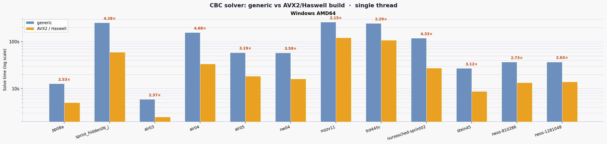

# cbcbox

**cbcbox** is a high-performance, self-contained Python distribution of the
[CBC](https://github.com/coin-or/Cbc) MILP solver (COIN-OR Branch and Cut),
built from the latest COIN-OR master branch.

On x86_64 (Linux, macOS, Windows) the wheel ships both a **[Haswell](https://en.wikipedia.org/wiki/Haswell_(microarchitecture))-optimised** binary
([AVX2](https://en.wikipedia.org/wiki/Advanced_Vector_Extensions)/FMA, full `-march=haswell` ISA) for maximum speed and a **generic** build with
runtime CPU dispatch for compatibility with any x86_64 machine — selected automatically.
All dynamic dependencies ([OpenBLAS](https://github.com/OpenMathLib/OpenBLAS), libgfortran, etc.) are bundled; no system libraries
or separate installation steps are needed.

### Highlights

- **Haswell-optimised & generic builds** — on x86_64 Linux, macOS, and Windows the wheel
  ships two complete solver stacks: a *Haswell* build (`-O3 -march=haswell`, OpenBLAS
  AVX2/FMA kernel) for maximum throughput, and a *generic* build (`DYNAMIC_ARCH` runtime
  dispatch) for compatibility with any x86_64 CPU. The best available variant is selected
  automatically at import time (see [Build variants](#build-variants)).

- **Debug build** — every wheel includes a `debug` variant compiled with `-O1 -g`
  (plus [AddressSanitizer](https://clang.llvm.org/docs/AddressSanitizer.html) on macOS). Activate with
  `CBCBOX_BUILD=debug` to diagnose hard-to-find bugs with clean stack traces
  (see [Debug build](#debug-build)).

- **Parallel branch-and-cut** — built with `--enable-cbc-parallel`. Use `-threads=N` to
  distribute the search tree across N threads, giving significant speedups on multi-core
  machines for hard MIP instances.

- **AMD fill-reducing ordering** — [SuiteSparse AMD](https://github.com/DrTimothyAldenDavis/SuiteSparse) is compiled in, enabling the
  high-quality `UniversityOfFlorida` Cholesky factorization for Clp's barrier (interior
  point) solver. AMD reordering produces much less fill-in on large sparse problems than
  the built-in native Cholesky, making barrier substantially faster.
  Activate with `-barrier -cholesky UniversityOfFlorida` (see [barrier usage](#barrier-interior-point-solver)).

## Performance (x86\_64)

> *Auto-updated by CI after each successful [workflow run](../../actions/workflows/wheel.yml).
> Single-threaded solve time — lower is better.*

<!-- PERF_PLOT_START -->



*Single-threaded solve time across benchmark instances. Speedup factor shown above each pair. Lower is better.*

<!-- PERF_PLOT_END -->

## Build variants

On **x86_64 Linux, macOS, and Windows**, the wheel ships two complete sets of binaries:

| Variant | OpenBLAS kernel | Clp SIMD | Minimum CPU |
|---|---|---|---|
| `generic` | `DYNAMIC_ARCH` (runtime dispatch) | standard | any x86_64 |
| `avx2` | `HASWELL` (256-bit AVX2/FMA) | `-march=haswell -DCOIN_AVX2=4` (all Haswell ISA extensions + 4-double AVX2 layout) | Haswell (2013+) |

At import time `cbcbox` automatically selects `avx2` when it is available **and**
the running CPU supports AVX2; otherwise it falls back to `generic`.

You can override this selection with the `CBCBOX_BUILD` environment variable:

```bash
# Force generic (portable) build
CBCBOX_BUILD=generic cbc mymodel.mps -solve -quit

# Force AVX2-optimised build (raises an error if not available)
CBCBOX_BUILD=avx2 cbc mymodel.mps -solve -quit

# Use debug build with AddressSanitizer (Linux/macOS) or -O1 -g (Windows)
CBCBOX_BUILD=debug cbc mymodel.mps -solve -quit
```

When `CBCBOX_BUILD` is set, a short summary of the selected build is printed to
stdout on every call — useful for tagging experiment results:

```
[cbcbox] CBCBOX_BUILD=avx2
[cbcbox]   binary  : .../cbcbox/cbc_dist_avx2/bin/cbc
[cbcbox]   lib dir : .../cbcbox/cbc_dist_avx2/lib
[cbcbox]   libs    : libCbc.so.3, libClp.so.3, libopenblas.so.0
```

> **Non-x86_64 platforms** (Linux aarch64, macOS arm64) ship `generic` and
> `debug` builds.  `CBCBOX_BUILD=avx2` will raise a `RuntimeError` on those
> platforms.

### Debug build

Every wheel includes a `debug` build compiled with `-O1 -g -fno-omit-frame-pointer`.
On macOS, [AddressSanitizer](https://clang.llvm.org/docs/AddressSanitizer.html)
(`-fsanitize=address`) is also enabled.  Linux manylinux containers do not
reliably provide `libasan`, so ASan is omitted there; Windows/MinGW does not
support ASan either.

Use the debug build to reproduce and diagnose bugs: on macOS CBC will abort with
a clear stack trace on memory errors; on all platforms reduced optimisation and
full debug symbols make stack traces from crashes much more readable.

```bash
# Run with debug symbols (-O1 -g) — ASan also active on macOS
CBCBOX_BUILD=debug cbc problem.mps -solve -quit
```

```python
import cbcbox, os
os.environ["CBCBOX_BUILD"] = "debug"
bin_path = cbcbox.cbc_bin_path()   # → .../cbc_dist_debug/bin/cbc
```

## Supported platforms

| Platform | Wheel tag |
|---|---|
| Linux x86\_64 | `manylinux2014_x86_64` |
| Linux aarch64 | `manylinux2014_aarch64` |
| macOS arm64 (Apple Silicon) | `macosx_11_0_arm64` |
| macOS x86\_64 | `macosx_10_9_x86_64` |
| Windows AMD64 | `win_amd64` |

## Installation

> **Note:** cbcbox is now available on PyPI — `pip install cbcbox`.
> Pre-built wheel artifacts are also available from the CI runs (see below).

### Installing from a pre-built wheel (recommended)

1. Go to the [Actions tab](../../actions/workflows/wheel.yml) of this repository.
2. Open the latest successful workflow run.
3. Download the artifact matching your platform:

   | Artifact name | Platform |
   |---|---|
   | `cibw-wheels-Linux-X64` | Linux x86\_64 |
   | `cibw-wheels-Linux-ARM64` | Linux aarch64 |
   | `cibw-wheels-macOS-ARM64` | macOS Apple Silicon |
   | `cibw-wheels-macOS-X64` | macOS x86\_64 |
   | `cibw-wheels-Windows-X64` | Windows AMD64 |

4. Unzip the artifact and install the `.whl` file:

   ```bash
   pip install cbcbox-*.whl
   ```

### Installing from PyPI

```bash
pip install cbcbox
```

## Usage

### Command line

After installation, CBC is available directly as the `cbc` command (pip installs
the entry point into the environment's `bin/` on Linux/macOS or `Scripts/` on Windows,
which is already on PATH):

```bash
cbc mymodel.lp -solve -quit
cbc mymodel.mps.gz -solve -quit
cbc mymodel.mps -seconds 60 -timem elapsed -solve -quit
cbc mymodel.mps -dualp pesteep -solve -quit
```

Alternatively, invoke via the Python module entry point:

```bash
python -m cbcbox mymodel.lp -solve -quit
```

CBC accepts LP, MPS and compressed MPS (`.mps.gz`) files. Pass `-help` for the
full list of options, or `-quit` to exit after solving.

#### Parallel branch-and-cut

This build includes parallel branch-and-cut (`--enable-cbc-parallel`).
Use `-threads=N` to distribute the search tree across N threads:

```bash
cbc mymodel.mps -threads=4 -solve -quit
```

#### Barrier (interior-point) solver

Clp's barrier solver can be faster than simplex for large LP relaxations.
This build includes SuiteSparse AMD, which enables the high-quality
`UniversityOfFlorida` Cholesky factorization — significantly reducing fill-in
compared to the built-in native Cholesky:

```bash
# Solve LP relaxation with barrier + AMD Cholesky, then crossover to simplex basis
cbc mymodel.mps -barrier -cholesky UniversityOfFlorida -solve -quit

# Useful as a root-node strategy inside MIP (let CBC use simplex for B&B):
cbc mymodel.mps -barrier -cholesky UniversityOfFlorida -solve -quit
```

Without AMD, only `-cholesky native` (less efficient) is available.

### Python API

The package exposes helpers to locate the installed files:

```python
import cbcbox
import subprocess

# Path to the cbc binary (cbc.exe on Windows).
cbcbox.cbc_bin_path()
# e.g. '/home/user/.venv/lib/python3.13/site-packages/cbcbox/cbc_dist/bin/cbc'

# Directory containing the static and dynamic libraries.
cbcbox.cbc_lib_dir()
# e.g. '.../cbcbox/cbc_dist/lib'

# Directory containing the COIN-OR C/C++ headers.
cbcbox.cbc_include_dir()
# e.g. '.../cbcbox/cbc_dist/include/coin'

# Run CBC programmatically.
result = subprocess.run(
    [cbcbox.cbc_bin_path(), "mymodel.mps", "-solve", "-quit"],
    capture_output=True, text=True,
)
print(result.stdout)
```

## What is built

The build pipeline compiles all components from source inside the CI runner,
in the following order:

| Component | Version / branch | Purpose |
|---|---|---|
| **Cbc** | master | Branch-and-cut MIP solver |
| **Cgl** | master | Cut generation library |
| **Clp** | master | Simplex LP solver (used as the MIP node relaxation) |
| **Osi** | master | Open Solver Interface |
| **CoinUtils** | master | Utility library (shared by all COIN-OR packages) |
| **[Nauty](https://pallini.di.uniroma1.it/)** | 2.8.9 | Symmetry detection for MIP presolve |
| **[AMD](https://github.com/DrTimothyAldenDavis/SuiteSparse)** (SuiteSparse v7.12.2) | v7.12.2 | Sparse matrix fill-reducing ordering |
| **[OpenBLAS](https://github.com/OpenMathLib/OpenBLAS)** | v0.3.31 | Optimised BLAS/LAPACK for LP basis factorisation |

On x86_64 Linux, macOS, and Windows the entire stack is compiled **twice**: once for the
`generic` variant (OpenBLAS `DYNAMIC_ARCH=1`) and once for the `avx2` variant
(`TARGET=HASWELL`, `CXXFLAGS=-O3 -march=haswell -DCOIN_AVX2=4`).  AMD and Nauty
are built only once (they are pure combinatorial code with no BLAS dependency)
and reused by both COIN-OR variants.

All COIN-OR components are linked into both **static** (`.a`) and **shared**
(`.so` / `.dylib`) libraries on Linux and macOS. On Windows only **shared**
libraries (`.dll`) are produced — MinGW's autotools does not support building
static and DLL simultaneously. The shared libraries are patched with
self-relative RPATHs and bundled inside the wheel, making them directly usable
via `cffi` or `ctypes` without any system installation.

## Wheel contents

The wheel installs under `cbcbox/` inside the site-packages directory.
On x86_64 Linux, macOS, and Windows it contains **two** dist trees; other platforms
contain only `cbc_dist/`:

```
cbc_dist/           ← generic build (all platforms)
cbc_dist_avx2/      ← AVX2-optimised build (x86_64 Linux/macOS/Windows)
├── bin/
│   ├── cbc           # CBC MIP solver binary  (cbc.exe on Windows)
│   └── clp           # Clp LP solver binary   (clp.exe on Windows)
├── lib/
│   ├── libCbc.so / libCbc.dylib / libCbc.dll  # CBC solver
│   ├── libCbcSolver.so ...
│   ├── libClp.so ...                          # Clp LP solver
│   ├── libCgl.so ...                          # Cut generation
│   ├── libOsi.so ...                          # Solver interface
│   ├── libOsiClp.so ...                       # Clp OSI binding
│   ├── libOsiCbc.so ...                       # CBC OSI binding (where available)
│   ├── libCoinUtils.so ...
│   ├── libopenblas.so / .dylib / .dll         # OpenBLAS BLAS/LAPACK
│   ├── pkgconfig/                             # .pc files for all libraries
│   └── <bundled runtime shared libs>          # Platform-specific — see below
└── include/
    ├── coin/      # COIN-OR headers (CoinUtils, Osi, Clp, Cgl, Cbc)
    ├── nauty/     # Nauty headers
    └── *.h        # SuiteSparse / AMD headers
```

### Bundled dynamic libraries

Because the static COIN-OR libraries link to OpenBLAS, which in turn links to
the Fortran runtime, the following shared libraries are bundled inside the wheel
and their paths are rewritten so no system installation is required.

#### Linux (`lib/` directory, RPATH set to `$ORIGIN`)

| Library | Description |
|---|---|
| `libopenblas.so.0` | OpenBLAS BLAS/LAPACK |
| `libgfortran.so.5` | GNU Fortran runtime |
| `libquadmath.so.0` | Quad-precision math (dependency of libgfortran) |

#### macOS (`lib/` directory, install names rewritten to `@rpath/`)

| Library | Description |
|---|---|
| `libopenblas.dylib` | OpenBLAS BLAS/LAPACK |
| `libgfortran.5.dylib` | GNU Fortran runtime |
| `libgcc_s.1.1.dylib` | GCC runtime |
| `libquadmath.0.dylib` | Quad-precision math |

#### Windows (`bin/` directory, DLLs placed next to the executable)

| Library | Description |
|---|---|
| `libopenblas.dll` | OpenBLAS BLAS/LAPACK |
| `libgfortran-5.dll` | GNU Fortran runtime |
| `libgcc_s_seh-1.dll` | GCC SEH runtime |
| `libquadmath-0.dll` | Quad-precision math |
| `libstdc++-6.dll` | C++ standard library (MinGW64) |
| `libwinpthread-1.dll` | POSIX thread emulation |

## CI / build pipeline

Wheels are built and tested automatically via GitHub Actions using
[cibuildwheel](https://cibuildwheel.pypa.io).  The workflow
(`.github/workflows/wheel.yml`) runs on five separate runners:

| Runner | Produces |
|---|---|
| `ubuntu-latest` | `manylinux2014_x86_64` wheel |
| `ubuntu-24.04-arm` | `manylinux2014_aarch64` wheel |
| `macos-15` | `macosx_11_0_arm64` wheel |
| `macos-15-intel` | `macosx_10_9_x86_64` wheel |
| `windows-latest` | `win_amd64` wheel |

After each wheel is built, the test suite in `tests/` is run against the
installed wheel to verify correctness.

### Integration tests

The test suite (`pytest`) solves twelve MIP instances and checks the optimal
objective values, in both single-threaded and parallel (3-thread) modes.
On x86_64 Linux, macOS, and Windows **each test is run twice** — once against
the `generic` binary and once against the `avx2` binary — and a side-by-side
performance comparison is recorded:

| Instance | Expected optimal | Time limit |
|---|---|---|
| `pp08a.mps.gz` | 7 350 | 300 s |
| `sprint_hidden06_j.mps.gz` | 130 | 900 s |
| `air03.mps.gz` | 340 160 | 600 s |
| `air04.mps.gz` | 56 137 | 600 s |
| `air05.mps.gz` | 26 374 | 900 s |
| `nw04.mps.gz` | 16 862 | 900 s |
| `mzzv11.mps.gz` | −21 718 | 900 s |
| `trd445c.mps.gz` | −153 419.078836 | 1200 s |
| `nursesched-sprint02.mps.gz` | 58 | 600 s |
| `stein45.mps.gz` | 30 | 300 s |
| `neos-810286.mps.gz` | 2 877 | 300 s |
| `neos-1281048.mps.gz` | 601 | 300 s |

Time limits are generous to avoid false failures on slow CI runners.

### Publishing to PyPI

> **Note:** cbcbox is not yet registered on PyPI.  When ready, trigger the
> workflow manually and select `pypi` (or `testpypi`) in the **Publish** input.
> Trusted Publisher (OIDC) authentication is used — no API tokens are stored as
> secrets.

## Performance results

> *Auto-updated by CI after each successful
> [workflow run](../../actions/workflows/wheel.yml).*

<!-- PERF_RESULTS_START -->

## Summary

Geometric mean solve time (seconds) across all test instances.

### 1 thread

| Platform | generic (s) | avx2 (s) | avx2 speedup |
|---|---|---|---|
| Darwin arm64 | 56.42 | — | — |
| Darwin x86_64 | 64.21 | 24.63 | 2.61× |
| Linux aarch64 | 70.04 | — | — |
| Linux x86_64 | 80.31 | 23.01 | 3.49× |
| Windows AMD64 | 85.51 | 25.28 | 3.38× |

### 3 threads

| Platform | generic (s) | avx2 (s) | avx2 speedup |
|---|---|---|---|
| Darwin arm64 | 55.14 | — | — |
| Darwin x86_64 | 51.28 | 26.04 | 1.97× |
| Linux aarch64 | 54.49 | — | — |
| Linux x86_64 | 64.83 | 22.88 | 2.83× |
| Windows AMD64 | 83.99 | 25.97 | 3.23× |

## Per-instance results

### `pp08a.mps.gz`

| Platform | Build | 1 thread (s) | 3 threads (s) | parallel speedup |
|---|---|---|---|---|
| Darwin arm64 | generic | 9.27 | 16.18 | 0.57× |
| Darwin x86_64 | avx2 | 4.37 | 10.24 | 0.43× |
| Darwin x86_64 | generic | 9.49 | 7.68 | 1.24× |
| Linux aarch64 | generic | 8.95 | 5.99 | 1.49× |
| Linux x86_64 | avx2 | 4.53 | 8.02 | 0.56× |
| Linux x86_64 | generic | 9.93 | 6.09 | 1.63× |
| Windows AMD64 | avx2 | 4.97 | 9.42 | 0.53× |
| Windows AMD64 | generic | 12.70 | 17.33 | 0.73× |

### `sprint_hidden06_j.mps.gz`

| Platform | Build | 1 thread (s) | 3 threads (s) | parallel speedup |
|---|---|---|---|---|
| Darwin arm64 | generic | 128.84 | 116.90 | 1.10× |
| Darwin x86_64 | avx2 | 43.30 | 43.46 | 1.00× |
| Darwin x86_64 | generic | 176.40 | 155.87 | 1.13× |
| Linux aarch64 | generic | 220.24 | 193.61 | 1.14× |
| Linux x86_64 | avx2 | 56.63 | 52.44 | 1.08× |
| Linux x86_64 | generic | 242.41 | 218.70 | 1.11× |
| Windows AMD64 | avx2 | 57.79 | 55.12 | 1.05× |
| Windows AMD64 | generic | 252.41 | 217.70 | 1.16× |

### `air04.mps.gz`

| Platform | Build | 1 thread (s) | 3 threads (s) | parallel speedup |
|---|---|---|---|---|
| Darwin arm64 | generic | 102.06 | 74.38 | 1.37× |
| Darwin x86_64 | avx2 | 48.95 | 33.66 | 1.45× |
| Darwin x86_64 | generic | 116.16 | 61.11 | 1.90× |
| Linux aarch64 | generic | 139.66 | 76.10 | 1.84× |
| Linux x86_64 | avx2 | 34.32 | 25.81 | 1.33× |
| Linux x86_64 | generic | 153.21 | 107.19 | 1.43× |
| Windows AMD64 | avx2 | 32.92 | 26.48 | 1.24× |
| Windows AMD64 | generic | 155.23 | 164.43 | 0.94× |

### `air05.mps.gz`

| Platform | Build | 1 thread (s) | 3 threads (s) | parallel speedup |
|---|---|---|---|---|
| Darwin arm64 | generic | 46.35 | 35.72 | 1.30× |
| Darwin x86_64 | avx2 | 22.27 | 18.68 | 1.19× |
| Darwin x86_64 | generic | 54.82 | 37.83 | 1.45× |
| Linux aarch64 | generic | 50.81 | 35.50 | 1.43× |
| Linux x86_64 | avx2 | 15.19 | 12.35 | 1.23× |
| Linux x86_64 | generic | 57.64 | 43.72 | 1.32× |
| Windows AMD64 | avx2 | 17.62 | 13.76 | 1.28× |
| Windows AMD64 | generic | 57.86 | 45.36 | 1.28× |

### `nw04.mps.gz`

| Platform | Build | 1 thread (s) | 3 threads (s) | parallel speedup |
|---|---|---|---|---|
| Darwin arm64 | generic | 32.72 | 33.88 | 0.97× |
| Darwin x86_64 | avx2 | 11.63 | 12.27 | 0.95× |
| Darwin x86_64 | generic | 33.31 | 34.92 | 0.95× |
| Linux aarch64 | generic | 40.53 | 40.82 | 0.99× |
| Linux x86_64 | avx2 | 14.15 | 14.44 | 0.98× |
| Linux x86_64 | generic | 57.64 | 54.54 | 1.06× |
| Windows AMD64 | avx2 | 15.24 | 15.93 | 0.96× |
| Windows AMD64 | generic | 56.34 | 53.60 | 1.05× |

### `trd445c.mps.gz`

| Platform | Build | 1 thread (s) | 3 threads (s) | parallel speedup |
|---|---|---|---|---|
| Darwin arm64 | generic | 174.33 | 165.21 | 1.06× |
| Darwin x86_64 | avx2 | 93.10 | 90.86 | 1.02× |
| Darwin x86_64 | generic | 197.26 | 188.03 | 1.05× |
| Linux aarch64 | generic | 208.19 | 204.57 | 1.02× |
| Linux x86_64 | avx2 | 78.41 | 74.16 | 1.06× |
| Linux x86_64 | generic | 219.04 | 218.31 | 1.00× |
| Windows AMD64 | avx2 | 102.79 | 101.74 | 1.01× |
| Windows AMD64 | generic | 240.93 | 232.84 | 1.03× |


<!-- PERF_RESULTS_END -->

## NAQ — Never Asked Questions

### Why not benchmark on the full [MIPLIB 2017](https://miplib.zib.de/) library?

Several practical constraints shape the benchmark set:

1. **CI time limits.**  GitHub Actions enforces a 6-hour wall-clock limit per
   job.  The full MIPLIB 2017 collection contains ~1 065 instances, many of
   which take hours even on fast hardware.  Including all of them would make
   every CI run time out before producing any useful measurements.

2. **Comparing apples to apples requires instances solved to optimality.**  If
   some instances are only solved within a time limit (i.e., a gap > 0 %), a
   meaningful performance comparison must account for both solve time *and*
   solution quality simultaneously.  This greatly complicates analysis and
   makes plots harder to interpret.  Restricting to instances that CBC reliably
   solves to proven optimality keeps the comparison clean: a single elapsed-time
   number per instance is all that is needed.

3. **The instance set is intentionally biased toward set packing / covering /
   partitioning structure.**  Most instances in the benchmark (`pp08a`,
   `sprint_hidden06_j`, `nw04`, `mzzv11`, `nursesched-sprint02`, `air0x`,
   `trd445c`) contain large blocks of set packing, covering, or partitioning
   constraints.  This structure arises naturally in applications such as crew
   scheduling, nurse scheduling, vehicle routing, and cutting stock —
   exactly the domain where [column generation](https://en.wikipedia.org/wiki/Column_generation)
   is most valuable.  Since the benchmark focuses on this problem class rather
   than providing a general-purpose solver survey, it is a specially interesting use case.

## License

CBC and all COIN-OR components are distributed under the
[Eclipse Public License 2.0](https://opensource.org/licenses/EPL-2.0).
OpenBLAS is distributed under the BSD 3-Clause licence.
SuiteSparse AMD is distributed under the BSD 3-Clause licence.
Nauty is distributed under the Apache 2.0 licence.

